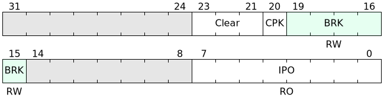

# bitfieldpy
Python3 porting of [bitfield](https://github.com/drom/bitfield) with all respect
to the original designer.

The library works exactly same as original program, except some of command line options.

- Added `-s/--svg` to output to a file; also can take `-` to output to stdout
- More strict to JSON format

# Install
The library requires svgwrite and attrdict libraries.

- `pip3 install bitfieldpy`(install archive from pypi)
- `pip3 install git+https://github.com/K4zuki/bitfieldpy.git`(edge/developing version)

# Options

```
usage: bitfieldpy.py [-h] [--input INPUT] [--svg SVG] [--vspace VSPACE]
                     [--hspace HSPACE] [--lanes LANES] [--bits BITS]
                     [--font-family FONT_FAMILY] [--font-weight FONT_WEIGHT]
                     [--font-size FONT_SIZE]

bitfield clone in python(experimental)

optional arguments:
  -h, --help            show this help message and exit
  --input INPUT, -i INPUT
                        <input bitfield source filename>
  --svg SVG, -s SVG     <output SVG image file name> or '-' to stdout
  --vspace VSPACE, -V VSPACE
                        height per lane in px
  --hspace HSPACE, -H HSPACE
                        width per lane in px
  --lanes LANES, -L LANES
                        number of lane
  --bits BITS, -B BITS  total bitwidth
  --font-family FONT_FAMILY, -F FONT_FAMILY
                        font family for all texts
  --font-weight FONT_WEIGHT, -W FONT_WEIGHT
                        font weight
  --font-size FONT_SIZE, -S FONT_SIZE
                        font size
```

|         parameter         | optional |          purpose          |   default    |
|---------------------------|----------|---------------------------|--------------|
| `--input`/`-i`            | **N**    | input file name           |              |
| `--svg`/`-s`              | **N**    | output file name          |              |
| `--vspace`/`-V`           | Y        | height per lane in px     | 80           |
| `--hspace`/`-H`           | Y        | width per lane in px      | 640          |
| `--lanes`/`-L`            | Y        | number of lanes           | 2            |
| `--bits`/`-B`             | Y        | total bit width           | 32           |
| `--font-family`/`-F`      | Y        | font family for all texts | "sans-serif" |
| `--font-font_weight`/`-W` | Y        | font weight               | "normal"     |
| `--font-size`/`-S`        | Y        | font size                 | 14           |



# License
**MIT License (c) 2018 Kazuki Yamamoto**
